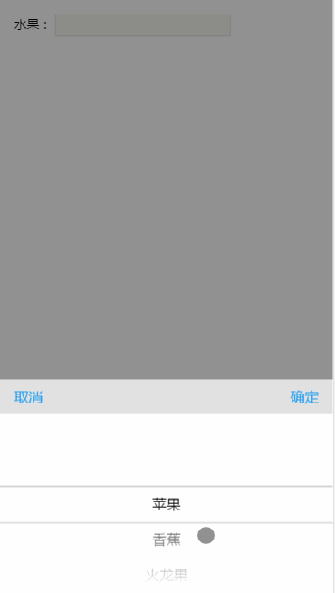
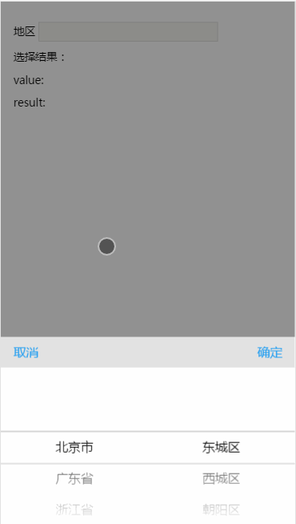
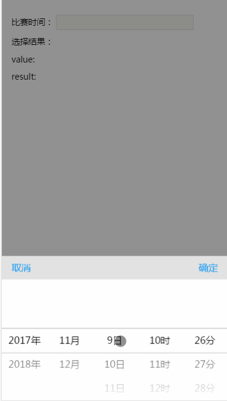
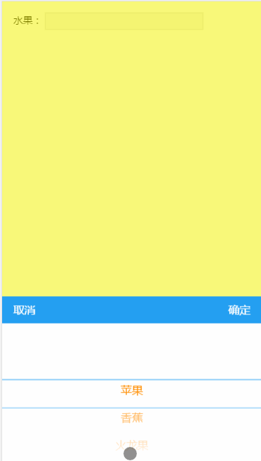

## 简介
这是一个为移动端web应用提供的仿iOS选择器的工具，使用简单，配置灵活，可以适用于多种场景。主要有以下的特点：

（1）支持多层级选择器

（2）提供多个操作接口，应对不同的需求

（3）支持样式自定义配置以及其他多个参数的配置

（4）支持异步加载数据,并动态改变picker

（5）兼容AMD和CMD规范

## 使用方法

1. **引入样式文件和js文件，如：**

	```html
	<link rel="stylesheet" href="mobile-picker.css">
	<script src="mobile-picker.js"></script>
	```

2. **传入参数，实例化一个picker**


	实例方法为 `new Picker(options)` ,一个最简单的例子如下：


	```javascript
	var fruit = ['苹果','香蕉','火龙果','芒果','百香果'];
	new Picker({
	  target: 'fruit',
	  data: fruit
	});
	```

	其中，`target`为触发picker显示的目标元素，值为元素的id或者dom元素，`data`为需要实例化供选择的数据集合。
	以上代码执行结果如下图所示：

	

3. **参数说明**

	| 参数名称     | 参数类型                | 默认值   |是否必须  |  参数说明  |
	| ----------- | -----------------------|:-------:|:-------:|-----------|
	| target      | HTMLElement|String     | 无      | 是      | 触发选择器的html元素，可为原生DOM对象或者html标签的的id名称 |
	| data        | Array: [String|Object] |[]       | 是      | 选择项目列表数组，数组项的值可以为字符串，也可以为对象。显示规则见textKey |
	| textKey     | String                 | 'value' | 否      | 用于显示列表的键名，当data数组元素为字符串时不起作用，当为对象时将取对象对应的键的值进行显示 |
	| value       | String|Array           | []      | 否      | picker默认值。当为一级picker时可以选择字符串，当为多级的picker时需传入数组,需要组合valueKey使用 |
    | valueKey    | String                 | 'value' | 否      | 默认值的键名，当传入value时，如果data中项目类型为对象，将会按照该键比对，实例化时默认选中对应的值 |
    | childKey    | String                 | 'child' | 否      | 子级集合的键名，当data中某一项含有该键名的数组，将生成下一级选择，如`data= [{text: '广州市','child':[{text:'荔湾区'},{text:'天河区'}]}]` |
    | autoFill    | Boolean                | true    | 否      | 是否自动填充结果，当`targe`t为`input`和`textarea`元素时，以**value**填充，其他文本元素以**innerText**填充 |
    | className   | String                 |  无     | 否      | picker最外层容器附加的class名称，可用于重写样式  |
    | lock        | Boolean                | false   | 否      | 是否锁定picker，当picker锁定时确认选择将不会执行，这在异步请求等待数据时可以用上，防止数据不完整 |
    | confirm     | Function(value,result) | 无      | 否      | 确定选择后的回调函数，接收两个参数，value为选择器文本拼接后的结果，默认用于填充元素，result为选择的原始数据出去子级列表后的集合,如[{text:'广州市'}，{text: '天河区'}] |
	| cancel      | Function               | 无      | 否      | 取消选择后的回调函数 |
    | select      | Function(scrollIndex,result,index,haschild)| 执行某个层级的选择时回调函数，接收参数分别为：当前所在的层级(从0计数)，当前已选择的结果，当前层级数据集合选中的索引值，是否有子级数据集合，详细见后面例子 |

4. **方法列表**

   实例化后，通过Picker实例可以访问和修改该实例的属性和调用实例的方法。

   主要有以下方法： 假设 `var picker = new Picker({...})`

  （1）`show` : 触发显示picker，实例化时参数中target绑定的touchstart事件就是调用了该方法从而显示picker，可以在需要的时候通过 `picker.show()`进行显示

   (2) `hide` : 与show相反，触发picker隐藏，实例中的cancel按钮就调用了该方法，可以通过	`picker.hide()`进行隐藏

   (3) `setLock(Boolean)`: 锁定或者解锁picker，其中传入`true`为锁定，锁定后点击确认按钮不做任何回调,这在异步请求数据有用，亦可通过`picker.lock = true`来设置，但是`setLock`除了改变lock值外，会为`confirm按钮`添加或移除一个`disabled`类，从而显示不同的视觉效果。

   (4) `setScroll(index,data,value,callback)`: 设置第`index`层的数据列表为`data`列表，`value`为更新后默认选中的值，类型为`String`，`callback`为更新后执行的回调函数，接收`(index，result)`两个参数，其中`index`为当前层级数，`result`为当前选中的结果集合

   (5) `removeScroll(index)`: 删除第index层及往后的选择列表

   (6) `update(options)`: 更新整个picker，options与实例化时的config格式一致，但不包含target

## 例子

  **(1) 多级选择器之城市列表（含选择确认后自动填的充出发地和自定义填充的目的地）**

 ```html
   <div class="container">
    <div>
      <label for="">出发地</label>
      <input type="text" id="start">
    </div>
    <div>
      <label for="">目的地</label>
      <input type="text" id="end">
    </div>
    <div class="print">
      <div>选择结果：</div>
      <div>startValue: <span id="startValue"></span></div>
      <div>startResult: <span id="startResult"></span></div>
      <div style="margin: 10px 0">--------------------</div>
      <div>endValue: <span id="endValue"></span></div>
      <div>endResult: <span id="endResult"></span></div>
    </div>
   </div>
 ```

 ```javascript

	var city = [
	  {
	    name: '北京市',
	    code:"110000",
	    list: [
	      {name: '东城区'},{name: '西城区'},{name: '朝阳区'},{name: '丰台区'},{name: '海淀区'},{name: '房山区'}
	    ]
	  },
	  {
	    name: '广东省',
	    code: "440000",
	    list:[
	      {
	        name: '广州市',
	        code: "440100",
	        list: [
	          {name: '海珠区',code:'440105'},
	          {name: '天河区',code: "440106",list:[{name: '黄埔大道'},{name: '中山大道'},{name: '华夏路'}]}
	        ]
	      },
	      {
	        name: '深圳市',
	        list: [{name: '罗湖区'},{name: '南山区'},{name: '福田区'},{name: '龙华新区'},{name: '龙岗区'},{name: '宝安区'}]
	      },
	      {name: '东莞市'},
	      {
	        name: '江门市',
	        list: [
	          {name: '台山市'},{name: '鹤山市'},{name: '开平市'},{name: '新会区'},{name: '恩平市'}
	        ]
	      }
	    ]
	  },
	  {
	    name: '浙江省',
	    list: [
	      {
	        name: '杭州市',
	        list: [{name: '桐庐县'},{name: '江干区'},{name: '西湖区'},{name: '下城区' }]
	      },{
	        name: '宁波市',
	        list: [{name: '江东区'},{name: '江北区'},{name: '高新区'},{name:'海曙区'},{name: '象山区'},{name:' 慈溪市'}]
	      }
	    ]
	  }
	];
    new Picker({
	  target: document.getElementById('start'),
	  data: city,
	  textKey: 'name',
	  childKey: 'list',
	  confirm: function(value,result){
	    document.getElementById('startValue').innerText = value;
	    document.getElementById('startResult').innerText = JSON.stringify(result);
	  }
	});
	new Picker({
	  target: 'end',
	  data: city,
	  textKey: 'name',
	  autoFill: false,
	  childKey: 'list',
	  confirm: function(value,result){
	      document.getElementById('endValue').innerText = value;
	      document.getElementById('endResult').innerText = JSON.stringify(result);
	      //结果处理后再显示
	      var text = [];
	      for(var i = 0; i < result.length; i++){
	        text.push(result[i].name);
	      }
	      this.target.value = text.join('-');//this.target取得当前的目标元素
       }
    });

 ```

效果如下图


**(2)异步加载数据**

 ```html
  <div class="container">
    <div>
      <label for="">地区</label>
      <input type="text" id="area">
    </div>
    <div class="print">
      <div>选择结果：</div>
      <div>value: <span id="value"></span></div>
      <div>result: <span id="result"></span></div>
    </div>
  </div>
 ```

 ```javascript

	function getDistrict(code){
	 var data = {
	  "code_440330" : [{name: '罗湖区'},{name: '南山区'},{name: '福田区'},{name: '龙华新区'},{name: '龙岗区'},{name: '宝安区'}],
	  "code_440100": [{name: '海珠区',code:'440105'},{name: '天河区',code: "440106",list:[{name: '黄埔大道'},{name: '中山大道'},{name: '华夏路'}]}],
	  "code_440700":  [{name: '台山市'},{name: '鹤山市'},{name: '开平市'},{name: '新会区'},{name: '恩平市'}],
	  "code_330100": [{name: '桐庐县'},{name: '江干区'},{name: '西湖区'},{name: '下城区' }],
	  "code_330200": [{name: '江东区'},{name: '江北区'},{name: '高新区'},{name:'海曙区'},{name: '象山区'},{name:' 慈溪市'}]
	  }
	  return data['code_'+code] || [];
	}
	var city = [
	  {
	    name: '北京市',
	    code:"110000",
	    list: [
	      {name: '东城区',code: '110101'},{name: '西城区',code: '110102'},{name: '朝阳区',code: '110105'},{name: '丰台区',code: '110106'},{name: '海淀区',code: "110108"},{name: '房山区',code:'110111'}
	    ]
	  },
	  {
	    name: '广东省',
	    code: "440000",
	    list:[
	      {name: '广州市',code: "440100"},
	      {name: '深圳市',code: '440330'},
	      {name: '东莞市',code:'441900'},
	      {name: '江门市',code: '440700'},
	    ]
	  },
	  {
	    name: '浙江省',
	    list: [
	      {name: '杭州市',code: "330100"},
	      {name: '宁波市',code: "330200"}
	    ]
	  }
	];
	var picker = new Picker({
	    target: 'area',
	    data: city,
	    textKey: 'name',
	    childKey: 'list',
	    confirm: function(value, result){
	      var str = [];
	      for(var i = 0, len = result.length; i < len; i++){
	        str.push(result[i].name);
	      }
	      this.target.value = str.join('-');
	      document.getElementById('value').innerText = value;
	      document.getElementById('result').innerText = JSON.stringify(result)
	    },
	    select: function(scrollIndex,result,index,haschild){
	      var city = result[scrollIndex];
	      console.log(city)
	      var that = this;
	      //当选择的是不是城市级别或者选择的是直辖市或者当前选择的城市有子级列表（没有的在请求后会被缓存）则不做操作
	      if(scrollIndex !== 1 || "11|12|31|50".indexOf(city.code.substring(0, 2)) >= 0 || haschild) return;
	      this.setScroll(scrollIndex + 1, []);//创建空白的下一级选择器，之所以这样做是防止页面抖动
	      that.setLock(true);//因为是异步请求，数据没返回之前锁定选择器,请留意效果图中的确定按钮
	      setTimeout(function(){//这里模拟一个1秒钟的异步请求
	        var data = getDistrict(city.code);//拿到异步数据
	        if(data.length){
	          that.setScroll(scrollIndex + 1, data);//更新下一级选择器的数据
	        } else {
	          that.removeScroll(scrollIndex + 1);//没有数据，则移除之前防止抖动的选择器
	        }
	        that.setLock(false);//请求完毕，解锁
	      },1000)
	    },
	})

 ```

效果如下图：



  **(3) 时间选择器**

  时间选择器也是在开发的过程经常碰到的，由于对于时间选择器来讲，所有的数据可以通过程序计算生成，且开发过程中对时间格式有不同的需求，如仅显示日期，仅显示时间或者时间日期都显示。因此，如果你仅仅只是要用到时间选择器，那么最好是使用[专门的时间选择器](###)来代替。如果不用特定的时间选择器，用该工具也是可以实现的。一种方法是可以先生成一份待选择的数据，然后直接实例化，另一种方法是通过提供的方法进行动态计算数据。以下用第二种方法实现一个显示 `YYYY-MM-DD H:i`的选择器例子，代码相当冗长。

   ```html

    <div class="container">
      <div>
        <label for="">比赛时间：</label>
        <input type="text" id="time">
      </div>
      <div class="print">
        <div>选择结果：</div>
        <div>value: <span id="value"></span></div>
        <div>result: <span id="result"></span></div>
      </div>
    </div>

   ```

   ```javascript

    var year = (new Date()).getFullYear();
    var times = [{value: year + '年',code: year },{value: (year + 1) + '年', code: year + 1}];
    new Picker({
      target: 'time',
      data: times,
      autoFill: false,
      confirm: function(value, result){
        var str = [];
        for(var i = 0, len = result.length; i < len; i++){
          str.push(result[i].code);
        }
        this.target.value = str.slice(0,3).join('-') + ' ' + str.slice(-2).join(':');
        document.getElementById('value').innerText = value;
        document.getElementById('result').innerText = JSON.stringify(result)
      },
      select: function(scrollIndex,result){
        if(scrollIndex == 0){//选择了年份
          this.setScroll(scrollIndex + 1, getMonth(result))
        } else if(scrollIndex == 1){//选择了月份
          this.setScroll(scrollIndex + 1, getDay(result))
        } else if(scrollIndex == 2){//选择了日
          this.setScroll(scrollIndex + 1, getHours(result));
        } else if(scrollIndex == 3) {//选择了时
          this.setScroll(scrollIndex + 1, getMinutes(result));
        }
      },
    })
    function getMonth(result){
      var arr = [], now = new Date();
      var start = result[0].code == now.getFullYear() ? now.getMonth() + 1 : 1;
      for(var i = start; i <= 12; i++){
        arr.push({value: i + '月',code: i});
      }
      return arr;
    }
    function getDay(result){
      var year = result[0].code, month = result[1].code;
      var now = new Date();
      var start = year == now.getFullYear() && month == now.getMonth() + 1 ? now.getDate() : 1;
      var key = [1,3,5,7,8,10,12].indexOf(month) != -1 ? 31 : ([4,6,9,11].indexOf(month) != -1 ? 30 : (year % 400 == 0 || year % 100 !=0 && year % 4 == 0 ) ? 29 : 28);
      var arr = [];
      for(var i = start; i <= key; i++){
        arr.push({value: i + '日',code: i});
      }
      return arr;
    }
    function getHours(result){
      var arr = [], now = new Date();
      var start = result[0].code == now.getFullYear() && result[1].code == now.getMonth() + 1 && now.getDate() == result[2].code ? now.getHours() : 1;
      for(var i = start; i <24; i++){
        var value = ('00'+i).slice(-2)
        arr.push({value: value +'时', code: value})
      }
      return arr;
    }
    function getMinutes(result){
      var arr = [], now = new Date();
      var start = result[0].code == now.getFullYear() && result[1].code == now.getMonth() + 1 && now.getDate() == result[2].code && now.getHours() == +result[3].code ? now.getMinutes() : 1;
      for(var i = start; i <60; i++){
        var value = ('00'+i).slice(-2);
        arr.push({value: value +'分',code: value})
      }
      return arr;
    }

   ```

   执行结果如下图：

   


## 关于样式

样式的修改是通过覆盖默认样式来实现的，可以有两种方法覆盖

 (1) 实例化时传入className属性，指定一个类名

 (2) 直接修改相应的样式

可以修改的样式类名列表如下：

> `mp-body`: 在执行`show`方法时为body标签添加的类样式仅有`overflow:hidden`一条，，用为禁止页面滚动，执行`hide`方法时会移除该类名

> `mp-mask`: 最外层容器类名，如果要修改遮罩层的样式，可以修改此类名的样式

> `mp-container`: 选择器的包含容器，如要修改选择器的定位，可以修改该类名样式

> `mp-header`:  选择器头部的样式

> `mp-confirm,mp-cancel`: 确定按钮和取消按钮的样式

> `mp-content`: 选择器主体的外部容器，包含选择器主体所有内容

> `mp-shadowup,mp-shadowdown`: 覆盖在选择器上下的渐变遮罩层的样式

> `mp-line`: 被选中项的默认为上下横向的元素对应的样式

> `mp-box`: 包含所有的可滚动的列表的容器

> `mp-list-wrap`: 单个滚动器的外部容器

> `.mp-list-wrap ul`: 列表

> `.mp-list-wrap li`: 列表项


一个例子：

 ```css

  .mp-mask {background: rgba(255,255,0,.5)}
  .mp-header{background: #249ff1;color:#fff;}
  .mp-list-wrap li {color:#ff8e01;}
  .mp-line{border-color: #249ff1;}

 ```

 ```javascript

  var fruit = ['苹果','香蕉','火龙果','芒果','百香果'];
  new Picker({
    target: 'fruit',
    data: fruit,
    value: '火龙果',
    confirm: function(value,data){
      console.log(value,data)
    }
  });

 ```

 执行结果如下：

 

##写在后面

 工具目前仅实现了基本的选择器功能。原声ios选择器实际还包含了3D变换的效果，后期会考虑加上。Picker所有的属性基本都测试通过，但可能会有未发现的bug，欢迎反馈。


